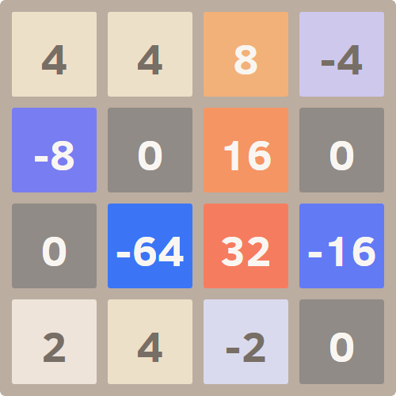

# ±64
A derivative of [2048](http://gabrielecirulli.github.io/2048/), which is a small clone of [1024](https://play.google.com/store/apps/details?id=com.veewo.a1024), based on [Saming's 2048](http://saming.fr/p/2048/) (also a clone).

The twist is the addition of negative numbers.  Get **both** 64 and -64 to win!

Made just for fun. [Play it here!](http://cuviper.github.io/pm64/)

### Contributions

First and foremost, [gabrielecirulli](https://github.com/gabrielecirulli/) created 2048!

 - [TimPetricola](https://github.com/TimPetricola) added best score storage
 - [chrisprice](https://github.com/chrisprice) added custom code for swipe handling on mobile
 - [elektryk](https://github.com/elektryk) made swipes work on Windows Phone
 - [mgarciaisaia](https://github.com/mgarciaisaia) addes support for Android 2.3

Many thanks to [rayhaanj](https://github.com/rayhaanj), [Mechazawa](https://github.com/Mechazawa), [grant](https://github.com/grant), [remram44](https://github.com/remram44) and [ghoullier](https://github.com/ghoullier) for the many other good contributions.

### Screenshot

That screenshot already has -64, and it's all lined up to create +64 for the win!

## Contributing
Changes and improvements are more than welcome! Feel free to fork and open a pull request. Please make your changes in a specific branch and request to pull into `master`! If you can, please make sure the game fully works before sending the PR, as that will help speed up the process.

Changes which would also be applicable to the original 2048 are encouraged to submit there first.

You can find the same information in the [contributing guide.](./CONTRIBUTING.md)

## License
±64 is licensed under the [MIT license.](./LICENSE.txt)

## Donations
I made this in my spare time, and it's hosted on GitHub (which means I don't have any hosting costs).  If you feel like donating, please consider the original 2048 project.
